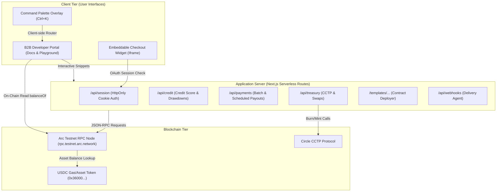
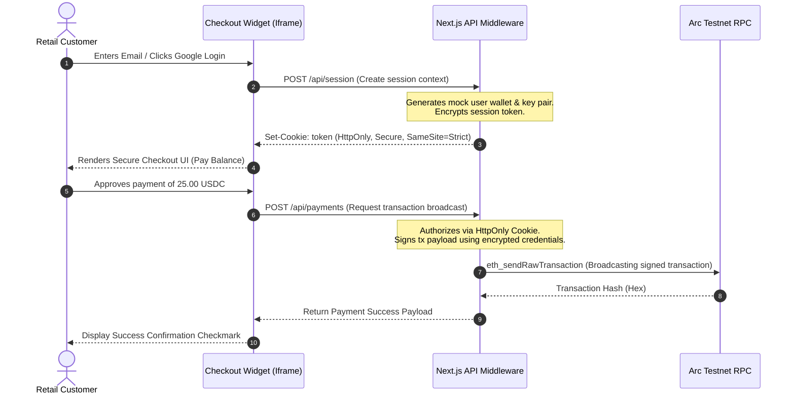
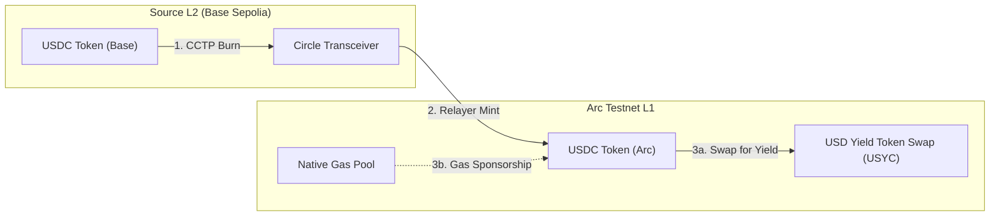
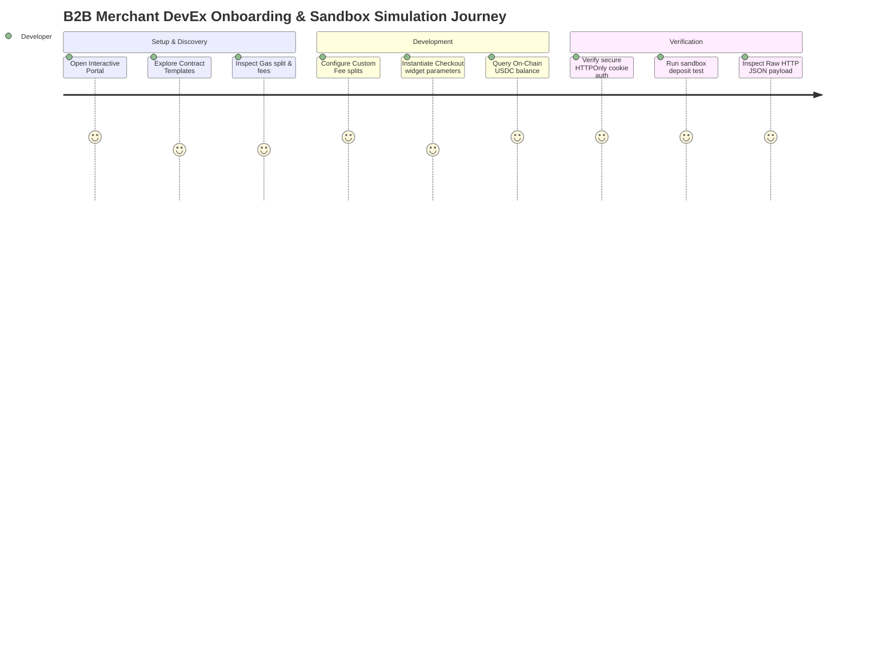
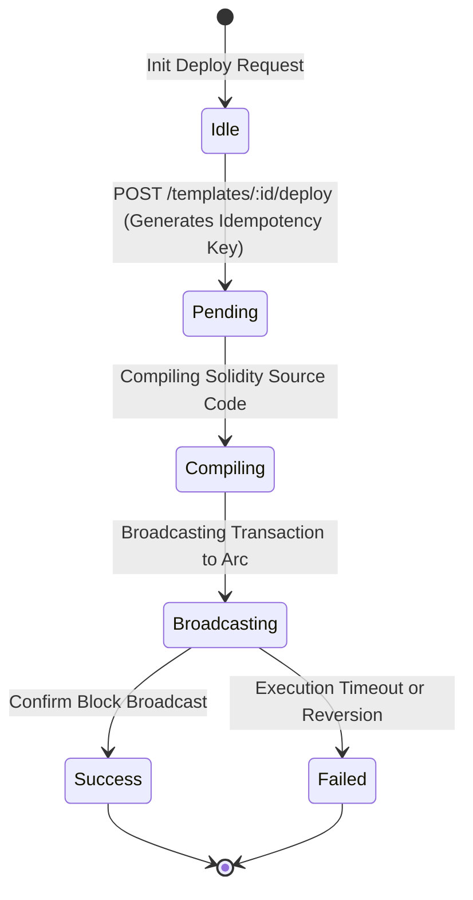

# 🚀 BizFlow: The Stablecoins Commerce Stack for SMEs

BizFlow is a production-grade, investor-ready stablecoin commerce gateway and developer platform designed to empower Small and Medium Enterprises (SMEs) with fast, friction-free payment flows. Built specifically to target the **Arc Testnet** (incorporating its sub-second finality and native USDC gas fee structure), BizFlow unifies checkout widgets, credit underwriting, scheduled payouts, treasury swaps, and custom smart contract deployment templates into a single high-performance portal.

---

## 🏗️ Architecture & System Design

BizFlow is architected with a hybrid static-serverless paradigm using the **Next.js App Router**. This design delivers an ultra-fast developer documentation site while providing robust, secure serverless endpoints to communicate with blockchain adapters, manage sandbox states, and securely issue sessions.

### 1. High-Level System Architecture
This diagram outlines the major blocks of the BizFlow ecosystem, depicting how B2B developers, retail customers, serverless API routes, and the Arc Testnet RPC node interact.



* **Client Tier:** Contains the primary interactive developer platform and the secure embeddable Checkout Widget. The Checkout Widget isolates customer credentials by rendering inside an `iframe`.
* **Application Server (Next.js API Routes):** Acts as a secure middleware layer. It holds server-side simulation rules, formats raw payloads, and shields private keys from being exposed to client browsers.
* **Blockchain Tier:** The live integration layer that queries the Arc Testnet JSON-RPC node for block numbers, gas pricing, and ERC-20 token balances using raw `eth_call` hex payloads.

---

### 2. Frontend ↔ Backend Interactive Request Lifecycle & Web3 Wallet Flow
The sequence diagram below describes the security boundary and step-by-step lifecycles of a client rendering a checkout page, authenticating a session, and broadcasting a transaction.



* **Architectural Decisions & Tradeoffs:**
  * **HttpOnly Session Cookies:** By storing session tokens in HttpOnly cookies, we mitigate cross-site scripting (XSS) risks. The frontend client code cannot read the credentials, protecting developer assets.
  * **Unified Balance Sandbox Runtime:** Rather than forcing users to hook up external MetaMask accounts for simple documentation experiments, BizFlow uses sandboxed backend credentials while enabling standard web3 extension overrides when requested.

---

### 3. CCTP Yield Swap & Gas Sponsorship Topology
The following workflow details how funds flow across chains via Circle's Cross-Chain Transfer Protocol (CCTP) and get deployed into institutional yield assets (USYC) on Arc.



* **What it Represents:** This diagram shows the cross-chain treasury pipeline.
* **Important Details:**
  * **USDC as Gas:** On Arc Testnet, the native gas token is USDC (represented in 18 decimals for gas units, while ERC-20 USDC uses 6 decimals).
  * **Gas Sponsorship:** The infrastructure automatically sponsors the L2 cross-chain burn/mint gas fee, providing sub-second confirmation times to end merchants.

---

### 4. B2B Merchant DevEx Onboarding Journey
This journey map details the stages a developer goes through to integrate the Checkout Widget and customize fee schedules.



* **What it Represents:** This journey map visualizes the developer experience (DevEx) flow, showing the developer's actions and satisfaction ratings at different integration steps.
* **Key Components:** Covers Setup & Discovery, Development, and Verification stages.
* **Architectural Tradeoffs:** Providing sandboxed execution consoles alongside real-time on-chain blockchain balance checks ensures a low-friction integration phase without compromising on live network feedback.

---

### 5. Smart Contract Idempotent Deployment State Machine
This state diagram illustrates the backend execution phases when compiling, deploying, and tracking smart contract deployments with unique idempotency keys.



* **What it Represents:** This state diagram shows the lifecycle of a smart contract template deployment.
* **Key Components:** State transitions from Idle to Pending, Compiling, Broadcasting, and final Success/Failed status.
* **Architectural Decisions:** The server uses the client's generated idempotency key to prevent duplicate deployments during network glitches or page refreshes.

---

## 📂 Repository Layout & Module Responsibilities

```bash
duongnq2798.eth/track-2-BizFlow/
├── src/
│   ├── app/
│   │   ├── api/
│   │   │   ├── credit/route.ts       # Underwriting logic & credit drawdown simulations
│   │   │   ├── payments/route.ts     # Scheduled payout automation & batch execution
│   │   │   ├── session/route.ts      # HttpOnly session manager for sandbox checkout
│   │   │   ├── treasury/route.ts      # CCTP bridging & yield swap simulation engines
│   │   │   └── webhooks/route.ts      # Webhook payload builder & delivery verification
│   │   ├── templates/
│   │   │   └── [templateId]/
│   │   │       ├── deploy/route.ts   # Contract template deployer (Idempotent tracking)
│   │   │       └── status/route.ts   # Status polling with simulated compilation steps
│   │   ├── widget/
│   │   │   └── checkout/
│   │   │       └── page.tsx          # Secure iframe Checkout Widget
│   │   ├── globals.css               # Global theme tokens, typography, & animation classes
│   │   ├── layout.tsx                # Base HTML Shell & viewport metadata
│   │   └── page.tsx                  # Main Interactive Developer Documentation Portal
├── next.config.mjs                   # Next.js configurations
└── package.json                      # Build scripts, project dependencies, & metadata
```

---

## 🛡️ Security Architecture & Threat Modeling

BizFlow addresses several Web3 and B2B specific security risks:

| Threat Vector | Attack Scenario | BizFlow Mitigation Strategy |
| :--- | :--- | :--- |
| **Private Key Theft** | Malicious extensions or scripts scanning memory for variables. | **Sandboxed Contexts & Red warnings:** Key imports require explicit user approval and are locked to sandbox environment chains (`0x4CEF52` ID only). Bright warning flags force prefix validations (`0x`). |
| **Cross-Site Scripting (XSS)** | Hijacking user sessions on the checkout widget page. | **HttpOnly Cookies:** Checkout sessions are secured via HttpOnly, SameSite=Strict cookies to deny JavaScript reading privileges. |
| **Double Spending** | Submitting identical payout requests twice due to RPC latency. | **Idempotent Keys:** Deployments and payments use unique idempotency tokens tracked on server states to verify transaction uniqueness. |
| **Swapping Slippage** | Frontrunning tokenized yield swaps (USDC -> USYC). | **Slippage Bounds:** Hardcoded price feeds verify minimum yield outputs on treasury swap routes. |

---

## 📈 Performance Optimizations & Production Scaling

* **RPC Node Caching:** The live Block Height and Gas Price are cached for 10 seconds. This prevents rate-limiting issues on the Arc Testnet RPC endpoints under heavy B2B portal loads.
* **Serverless Cold-Start Reduction:** Next.js API routes use modular imports (Viem adapters are initialized lazily inside handler invocations) to keep the initial serverless bundle size minimal.
* **Global Styles Separation:** By refactoring all styled components to utilize class rules in `globals.css`, we bypassed the SSR hydration overhead of dynamic styled-jsx inside Next.js App Router sub-routes.

---

## 📋 Pre-Configured Smart Contract Templates

BizFlow supports modular Solidity template blueprints, allowing SMEs to deploy contracts instantly without writing code:
1. **Standard SME Commerce Token:** A gas-optimized ERC-20 token supporting adjustable gas fee sponsorship rules.
2. **Yield Compounder Vault:** A contract that accepts USDC, routes it through CCTP, and swaps it into tokenized institutional treasuries (e.g. USYC) to compound yield.
3. **Split Revenue Distributor:** Automatically routes incoming payments into preset proportions (e.g., 90% Admin operations, 10% Arc Gas pool).

---

## 🤖 AI Agent Workforce (Arc Agentic Economy)

BizFlow integrates with the **Arc Agentic Economy** specifications, enabling businesses to delegate operations to autonomous AI agents through secure, on-chain job escrows:

*   **Identity & Reputation (ERC-8004):** AI Agents are verified against persistent registry contracts to inspect performance scores, success rates, and active history logs.
*   **Job Escrow & Settlement (ERC-8183):** Governs gig agreements where USDC fees are locked securely in an escrow contract and disbursed automatically once a neutral Evaluator Oracle confirms completion of the deliverables (IPFS proof hash).

### On-Chain Transaction Hook:
When using a connected web3 browser wallet (e.g. MetaMask, Rainbow) in the dashboard, initiating an agent job requests a real USDC signature to transfer funds to the escrow target address:
*   **Escrow Contract Address:** `0x8183E5c700000000000000000000000000000000` (on Arc Testnet)
*   **Asset:** USDC (6 decimals, address `0x3600000000000000000000000000000000000000`)

---

## 📖 REST API Endpoints Reference

### 1. Smart Contract Deployment
* **POST `/templates/:templateId/deploy`** - Deploys a selected smart contract template.
  * *Request Body:* `{ "name": "SME Token", "symbol": "SMET" }`
  * *Response Body:*
    ```json
    {
      "success": true,
      "idempotencyKey": "idem-941a87b2",
      "status": "pending",
      "txHash": "0x51c7..."
    }
    ```
* **GET `/templates/:templateId/status`** - Polls deployment compilation and broadcasting status.

### 2. Payments & Payouts
* **POST `/api/payments`** - Executes scheduled or batch payouts.
  * *Request Body (Batch):* 
    ```json
    { 
      "action": "batch", 
      "recipients": [
        { "address": "0x37648342410a82be0a8276f5713437e9081a3e51", "amount": "15.00" },
        { "address": "0x82f1ed2b3a4a0c8b93d48e89f81a7b0f81d1a932", "amount": "10.00" }
      ] 
    }
    ```

### 3. Treasury Yield Swap
* **POST `/api/treasury`** - Converts idle stablecoins into interest-bearing yield tokens.
  * *Request Body:* `{ "action": "swap", "amount": "1000", "fromToken": "USDC", "toToken": "USYC" }`

### 4. AI Agent Escrow
* **POST `/api/agents/escrow`** - Locks USDC in an ERC-8183 Job Escrow contract.
  * *Request Body:* `{ "agent": "0x7e8...", "amount": "10.00", "taskDescription": "Reconcile Q1 corporate expense sheet" }`
  * *Response Body:*
    ```json
    {
      "success": true,
      "txHash": "0x8183...",
      "status": "settled"
    }
    ```

---

## 📡 Webhook Event Specifications

BizFlow supports cryptographically signed webhook notifications to keep B2B ERP and accounting databases in sync:

### Event: `payment.succeeded`
Dispatched when a retail customer successfully completes a payment through the checkout widget.
```json
{
  "event": "payment.succeeded",
  "id": "evt_91b72a4d",
  "timestamp": "2026-05-20T13:22:31Z",
  "data": {
    "merchant": "BizFlow SME",
    "amount": "25.00",
    "currency": "USDC",
    "transactionHash": "0x36b7cf918a28...",
    "network": "Arc Testnet"
  }
}
```

---

## 🚀 Getting Started

### Prerequisites
* **Node.js** (v18.0.0 or higher)
* **npm** or **yarn**

### Installation & Run

1. Clone the repository and navigate to the directory:
   ```bash
   cd track-2-BizFlow
   ```

2. Install dependencies:
   ```bash
   npm install
   ```

3. Run the development server:
   ```bash
   npm run dev
   ```

4. Build for production:
   ```bash
   npm run build
   ```

5. Open [http://localhost:3000](http://localhost:3000) in your browser. Use `Ctrl+K` to search the API portal, or trigger sandbox deposits in real-time.
